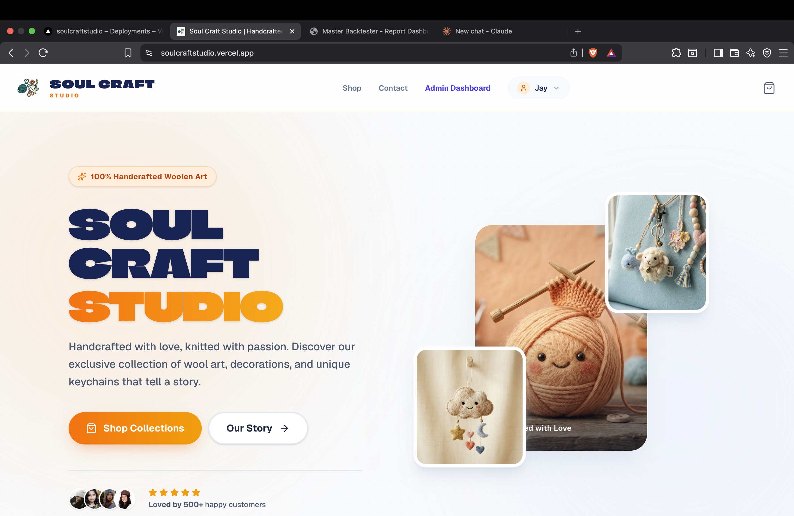
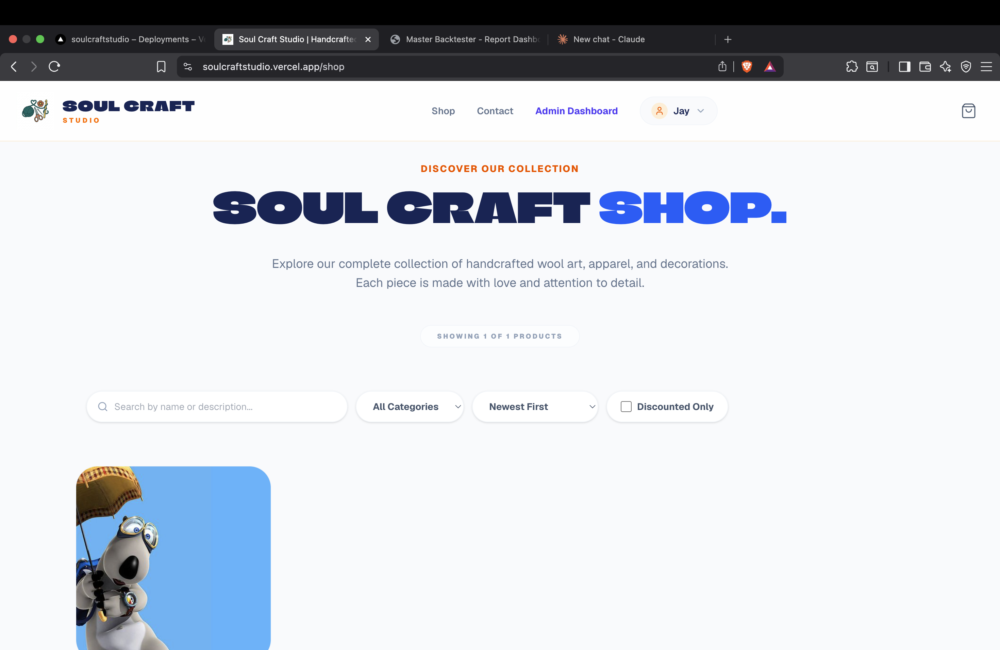
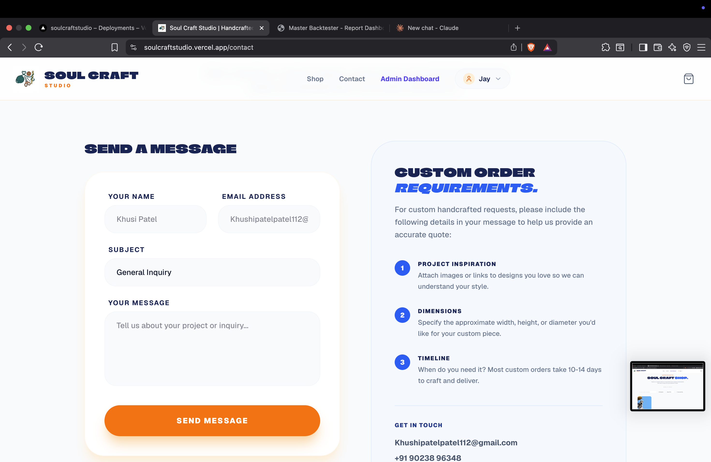
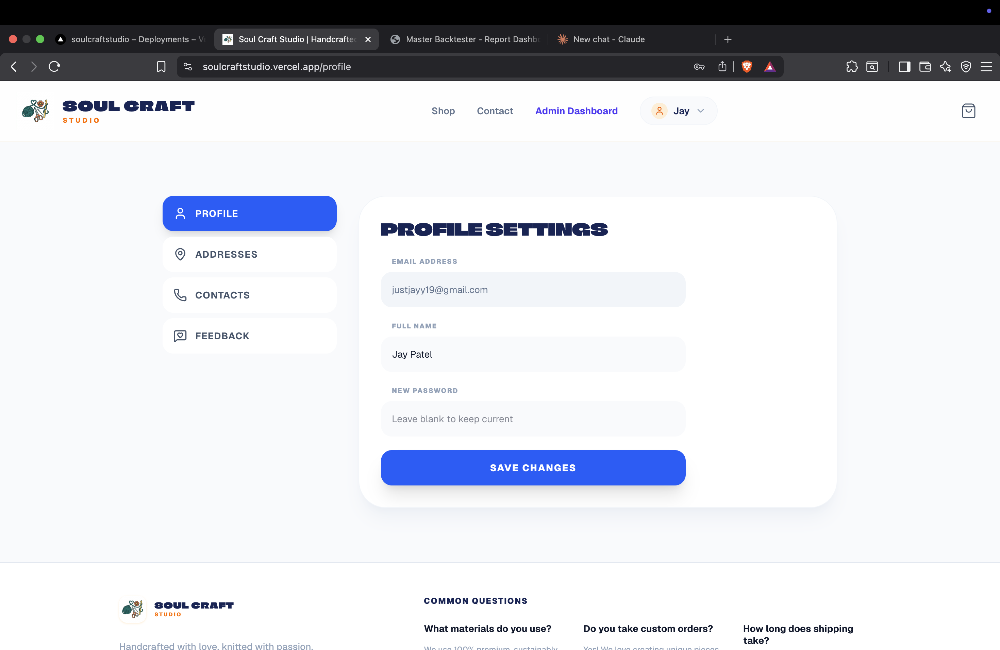
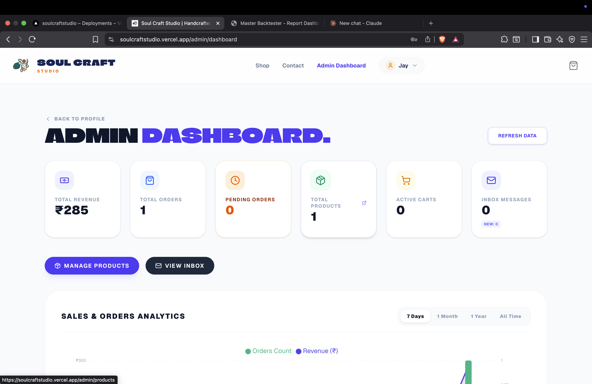
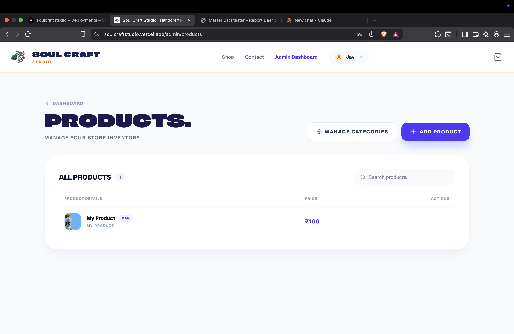
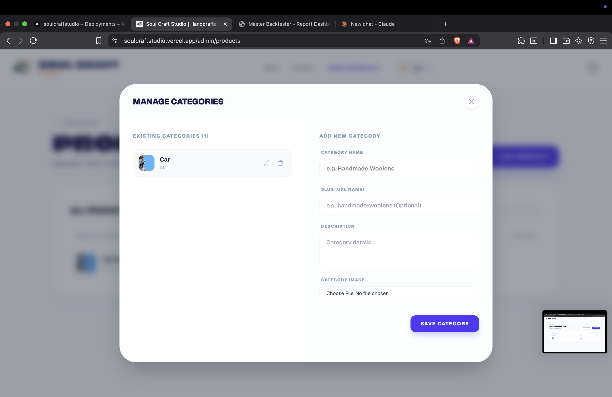
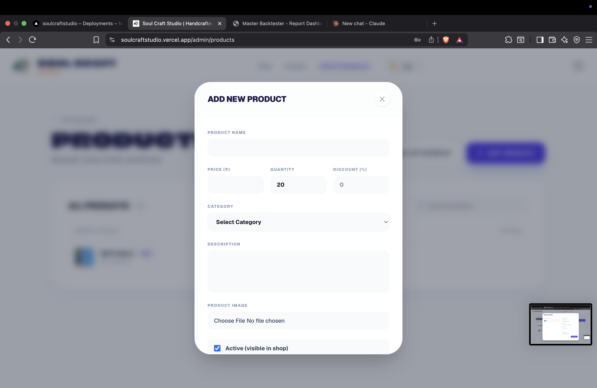

# 🧶 Soul Craft Studio

**100% Handcrafted Woolen Art** — an e-commerce platform for handmade wool art, decorations, and unique keychains, built with love and knitted with passion.

🔗 **Live Demo:** [soulcraftstudio.vercel.app](https://soulcraftstudio.vercel.app)

---

## 📖 About

Soul Craft Studio is a full-stack e-commerce web app for a handmade woolen craft business. It has a customer-facing storefront (browse products, place custom order requests, contact the studio) and an admin dashboard for the store owner to manage products, categories, and track sales/orders.

---

## ✨ Features

- 🛍️ **Storefront** — browse handcrafted wool products with search, category filters, and sorting
- ✉️ **Contact & Custom Orders** — dedicated form for general inquiries and custom order requests (with guidance on inspiration, dimensions, and timeline)
- 👤 **User Profile** — manage account details (name, email, password), addresses, contacts, and feedback
- 📊 **Admin Dashboard** — at-a-glance store metrics: revenue, orders, pending orders, products, active carts, and inbox messages
- 📦 **Product Management** — add, edit, and organize products with pricing, quantity, discounts, images, and active/inactive status
- 🏷️ **Category Management** — create and manage product categories with images and descriptions
- 📈 **Sales Analytics** — visual charts for orders and revenue over 7 days, 1 month, 1 year, or all time

---

## 🖼️ Screenshots

### 1. Home Page
Landing page introducing the brand, featured products, and customer trust signals (ratings & reviews).



### 2. Shop Page
Browse all available products with search, category filter, sorting, and discount filter options.



### 3. Contact Page
Send general inquiries or request custom handcrafted orders, with clear guidelines on what details to include.



### 4. Profile Page
Manage personal account details — email, full name, and password, plus quick access to addresses, contacts, and feedback.



### 5. Admin Dashboard
Overview of store performance — total revenue, orders, pending orders, products, active carts, inbox messages, and a sales/orders analytics chart.



### 6. Admin — Products
Manage full store inventory: view, search, and edit all listed products.



### 7. Manage Categories
Add, edit, or delete product categories with name, slug, description, and image.



### 8. Add New Product
Add a new product to the store with name, price, quantity, discount, category, description, image, and visibility toggle.



---

## 🛠️ Tech Stack

> _Update this section with your actual stack._

- **Frontend:** Next.js
- **Deployment:** Vercel
- **Backend / Database:** _add here (e.g. Django, FastAPI, Frappe, etc.)_

---

## 🚀 Getting Started

```bash
# Clone the repository
git clone https://github.com/<your-username>/soul-craft-studio.git
cd soul-craft-studio

# Install dependencies
npm install

# Run the development server
npm run dev
```

Open [http://localhost:3000](http://localhost:3000) in your browser to see the result.

---

## 📂 Project Structure

```
soul-craft-studio/
├── screenshots/         # App screenshots used in this README
├── ...                  # Add your actual project structure here
└── README.md
```

---

## 📬 Contact

For custom order inquiries or support, use the in-app **Contact** page, or reach out directly:

- 📧 Email: khushipatelpatel112@gmail.com
- 📞 Phone: +91 90238 96348

---

## 📄 License

_Add your license here (e.g. MIT)._
